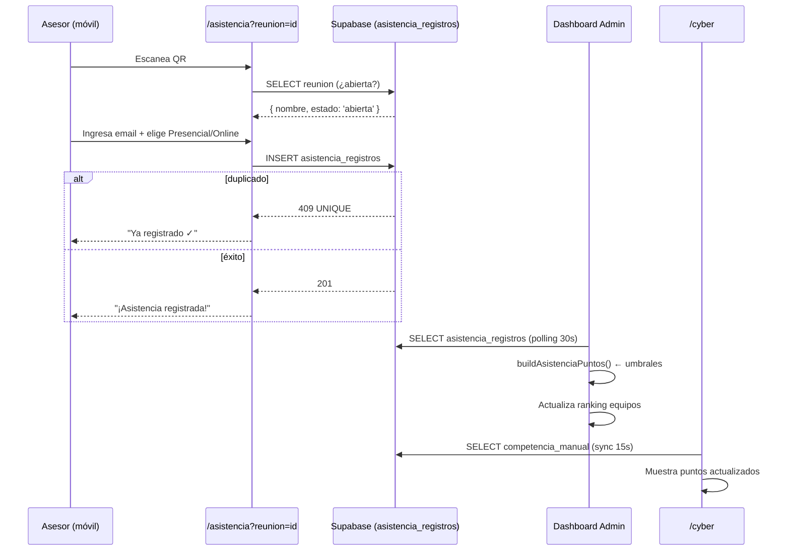

# PRD — Sistema de Asistencia a Reuniones con QR

| Campo | Valor |
|-------|--------|
| **Versión** | 1.0 |
| **Fecha** | 25 mayo 2026 |
| **Estado** | Diseño — pendiente aprobación de opción |
| **Repositorio** | Dashboard Encuentro Smart |
| **Alcance** | QR por reunión + registro de asistencia + puntos por porcentaje de asistencia |
| **Reemplaza / extiende** | `PRD-google-forms-asistencia.md` (este PRD supercede el flujo Google Forms para el caso de asistencia a reuniones) |

---

## 1. Resumen ejecutivo

Se requiere un sistema end-to-end que permita:

1. **Admin** crea y edita reuniones desde el dashboard.
2. Cada reunión genera un **código QR** único.
3. El **asesor** escanea el QR → abre un formulario ligero → ingresa su email `@capitalinteligente.cl` → elige **Presencial / Online**.
4. El sistema identifica automáticamente el **grupo BP** y el **equipo Capital Open** del asesor.
5. Por cada reunión se calcula el **% de asistencia** por equipo (sobre el total de miembros del equipo) y se otorgan **+15 pts** al equipo si alcanza los umbrales:
   - ≥ 80 % de miembros asistieron de forma **Online**
   - ≥ 50 % de miembros asistieron de forma **Presencial**
6. El dashboard suma esos puntos al ranking de competencia en tiempo real.

---

## 2. Contexto de arquitectura

### 2.1 Stack actual

| Capa | Tecnología |
|------|------------|
| UI | React 18 + Vite 5, CSS Modules |
| Auth admin | Supabase OTP + `VITE_ADMIN_EMAILS` |
| Datos manuales | Supabase `encuentro_competencia_manual` (patrón ya probado) |
| Asesores | `src/data/asesores-bp.json` (generado desde xlsx) |
| Equipos | `src/data/competenciaCapitalOneTeams.js` |
| Scoring actual | `src/utils/competenciaCapitalOpenScore.js` — `SCORING.actividadOnline/Presencial = 15` por conteo |
| Deploy | Vercel (SPA) + Supabase como backend |

### 2.2 Mapeo asesor → equipo (ya existe)

```
email  →  asesores-bp.json  →  bp_slug  →  EQUIPOS_CAPITAL_ONE[n].brokers[].bpSlugs
```

`src/utils/asesorBpPlataforma.js` → `lookupAsesorBp(email)`

### 2.3 Relación con PRD anterior

`PRD-google-forms-asistencia.md` planteó un flujo **Google Forms → Apps Script → Edge Function**. Este PRD lo **reemplaza** para el caso de asistencia a reuniones porque:

- El formulario QR propio elimina la dependencia de Google Forms.
- El registro de presencia es directo (no webhook indirecto).
- Se introduce lógica de **puntos por porcentaje** que requiere tabla de reuniones editable.

Se mantiene el patrón de **Supabase Edge Function** para escrituras sensibles.

---

## 3. Problema y usuarios

| Persona | Necesidad |
|---------|-----------|
| **Asesor** | Registrar asistencia en < 30 s desde su móvil escaneando el QR de la sala |
| **Coordinador / Admin** | Crear, editar y cerrar reuniones; ver asistencia en tiempo real por reunión, BP y equipo |
| **Dashboard Competencia** | Sumar +15 pts a un equipo automáticamente si cruza el umbral de asistencia |

---

## 4. Reglas de negocio

### 4.1 Umbrales de puntos por reunión

| Condición | Puntos |
|-----------|--------|
| ≥ 80 % de los miembros del equipo registraron asistencia **Online** en esa reunión | **+15 pts al equipo** |
| ≥ 50 % de los miembros del equipo registraron asistencia **Presencial** en esa reunión | **+15 pts al equipo** |

- Los dos umbrales son **independientes** — ambos pueden cumplirse en la misma reunión (máx. +30 pts / equipo / reunión).
- Si en reuniones distintas se cruza el mismo umbral, los puntos se suman por cada reunión donde se cruzó.
- **Base del porcentaje:** total de asesores activos del equipo (según `asesores-bp.json` + `equipoComercialInterno`).

### 4.2 Deduplicación

Un asesor solo puede registrar **una asistencia por reunión**. Segundo intento del mismo email en la misma reunión → muestra mensaje "Ya registrado" sin crear duplicado.

### 4.3 Validación de email

Solo se aceptan emails con dominio `@capitalinteligente.cl`. Emails no encontrados en la maestra → error visible (no silencioso).

### 4.4 Reuniones editables

El admin puede:
- **Crear** una reunión con nombre, fecha y estado (`abierta` / `cerrada`).
- **Editar** nombre y fecha mientras esté `abierta`.
- **Cerrar** manualmente (no se aceptan más registros).
- **Eliminar** solo si no tiene asistencias registradas.

### 4.5 QR por reunión

El QR apunta a una URL pública (no requiere login): `/asistencia?reunion=<id>`.  
La página es mínima, carga rápido en móvil y no importa `AuthContext`.

---

## 5. Opciones de arquitectura

### 5.1 Matriz comparativa

| Criterio | **A. Supabase directo (anon + RLS)** | **B. Supabase Edge Function** | **C. Vercel API Routes** |
|----------|--------------------------------------|-------------------------------|--------------------------|
| Escritura desde el form público | `INSERT` con anon key + RLS permisiva para `INSERT` | Edge Function con secret | API Route en Vercel |
| Cálculo de puntos | En el cliente (dashboard) al leer | En la Edge Function al insertar | En API Route al insertar |
| Complejidad de RLS | Media (anon puede insertar en tabla asistencia, no en competencia) | Baja (function usa service role) | Baja |
| Tiempo implementación | **1 día** | 1,5 días | 2 días |
| Sin infraestructura nueva | ✅ | ✅ | Requiere configurar `api/` en Vercel |
| Lógica de puntos centralizada | En cliente React | En servidor (más seguro) | En servidor |
| Riesgo | Política RLS debe ser muy cuidadosa | Bajo | Deploy de API routes en Vercel |

### 5.2 Opción A — Supabase directo (anon INSERT + RLS) — Más simple

```
Formulario QR (página pública React)
  → supabase.from('asistencia_reuniones').insert(row)   ← anon key
  → RLS: anon puede INSERT solo si reunion.estado = 'abierta'
  → RLS: anon NO puede UPDATE/DELETE

Dashboard admin
  → lee asistencia con anon/authenticated (SELECT con RLS)
  → calcula puntos en cliente con buildAsistenciaPuntos()
  → pushCompetenciaManualRemote() con puntos de asistencia ← service role via admin

Cálculo de puntos:
  → Al cargar el dashboard, useAsistenciaReuniones() agrega por equipo
  → Si umbral cruzado → suma puntos en manualByTeamId junto con actividades
```

**Pros:** mínima infraestructura nueva; el patrón ya existe en el repo.  
**Contras:** lógica de puntos en cliente; un admin malicioso podría leer todos los emails (mitigable con RLS).

### 5.3 Opción B — Supabase Edge Function (recomendada para producción) — Más robusta

```
Formulario QR (página pública React)
  → POST https://<project>.supabase.co/functions/v1/registrar-asistencia
      Body: { reunion_id, email, modalidad }
  → Edge Function (Deno):
      1. Valida email @capitalinteligente.cl
      2. lookupAsesorMaestra(email) → bp_slug, equipo_id
      3. INSERT asistencia_reuniones (upsert con ON CONFLICT DO NOTHING)
      4. Recalcula porcentajes del equipo para esa reunión
      5. Si umbral cruzado → UPSERT en encuentro_asistencia_puntos (flag)
  → Dashboard lee asistencia_puntos con anon (RLS)
  → useCompetenciaManualRemoteSync incorpora asistencia_puntos al total
```

**Pros:** lógica de puntos en servidor; RLS más estricto (anon no ve emails); idempotente.  
**Contras:** requiere deploy de Edge Function; maestra debe estar embebida en la function o en tabla SQL.

### 5.4 Opción C — Vercel API Routes

Solo válida si el deploy ya es Vercel Pro (functions sin cold start). Similar en seguridad a Opción B pero requiere cambios en `vercel.json` y un archivo `api/registrar-asistencia.ts`. No se recomienda si ya hay Supabase configurado.

---

## 6. Recomendación

> **Opción A para MVP rápido (< 1 semana); Opción B si queda tiempo o el evento dura más.**

Dado que el scoring final siempre pasa por el admin antes de publicar al `/cyber`, el riesgo de hacer el cálculo en cliente es bajo y permite entregar más rápido.

---

## 7. Diseño detallado (Opción A — recomendada para MVP)

### 7.1 Modelo de datos SQL

```sql
-- Tabla de reuniones (admin CRUD)
CREATE TABLE public.asistencia_reuniones_config (
  id          uuid PRIMARY KEY DEFAULT gen_random_uuid(),
  nombre      text NOT NULL,
  fecha       date,
  estado      text NOT NULL DEFAULT 'abierta'  -- 'abierta' | 'cerrada'
              CHECK (estado IN ('abierta', 'cerrada')),
  created_at  timestamptz DEFAULT now(),
  created_by  text  -- email del admin que la creó
);

-- Tabla de asistencias (una fila por asesor por reunión)
CREATE TABLE public.asistencia_registros (
  id          uuid PRIMARY KEY DEFAULT gen_random_uuid(),
  reunion_id  uuid NOT NULL REFERENCES asistencia_reuniones_config(id) ON DELETE CASCADE,
  email       text NOT NULL,
  nombre      text,
  bp_slug     text,
  equipo_id   int,
  equipo_label text,
  modalidad   text NOT NULL CHECK (modalidad IN ('Presencial', 'Online')),
  registrado_en timestamptz DEFAULT now(),
  UNIQUE (reunion_id, email)
);

-- Vista materializada de puntos por equipo por reunión (calculada en query)
-- No se almacena: el dashboard la calcula con SQL o JS.
```

**RLS sugerido:**

```sql
-- Lectura pública de reuniones abiertas (para el formulario QR)
CREATE POLICY "ver reuniones abiertas"
  ON asistencia_reuniones_config FOR SELECT
  USING (estado = 'abierta');

-- Admin puede ver y gestionar todo
CREATE POLICY "admin full access reuniones"
  ON asistencia_reuniones_config FOR ALL
  USING (auth.role() = 'authenticated');

-- Anon puede insertar asistencias solo en reuniones abiertas
CREATE POLICY "registro asistencia anon"
  ON asistencia_registros FOR INSERT
  WITH CHECK (
    EXISTS (
      SELECT 1 FROM asistencia_reuniones_config r
      WHERE r.id = reunion_id AND r.estado = 'abierta'
    )
  );

-- Anon NO puede leer emails de otros (protección de datos)
CREATE POLICY "lectura admin asistencias"
  ON asistencia_registros FOR SELECT
  USING (auth.role() = 'authenticated');
```

### 7.2 Módulos frontend nuevos

```
src/
  api/
    asistenciaRemote.js         ← fetchReuniones(), insertAsistencia(), fetchAsistencias()
    reunionesAdmin.js           ← createReunion(), updateReunion(), closeReunion(), deleteReunion()
  hooks/
    useAsistenciaPublic.js      ← hook para el formulario QR (sin auth)
    useAsistenciaAdmin.js       ← hook para el dashboard admin
  utils/
    buildAsistenciaPuntos.js    ← calcula % y puntos por equipo por reunión
  pages/
    AsistenciaFormPage.jsx      ← /asistencia?reunion=<id> (pública, sin AuthProvider)
  components/
    asistencia/
      AsistenciaForm.jsx        ← email input + toggle Presencial/Online + submit
      ReunionQRCard.jsx         ← muestra QR + nombre reunión + estado
      AsistenciaTable.jsx       ← tabla de registros filtrable (admin)
      AsistenciaPuntosResumen.jsx ← resumen de puntos por equipo (admin)
  features/
    asistenciaAdmin/
      AsistenciaAdminPage.jsx   ← gestión de reuniones + QR + vista asistencias
      ReunionForm.jsx            ← crear/editar reunión
```

### 7.3 Router en main.jsx

```jsx
// /asistencia y /asistencia/* → AsistenciaFormPage (SIN AuthProvider)
// todo lo demás → App (CON AuthProvider)
```

La misma lógica que ya existe para `/cyber`:

```jsx
// src/main.jsx
const path = window.location.pathname
if (path === '/asistencia' || path.startsWith('/asistencia/')) {
  root.render(<AsistenciaFormPage />)
} else if (path === '/cyber' || path.startsWith('/cyber/')) {
  root.render(<RankingPublicoPage />)
} else {
  root.render(<AuthProvider><App /></AuthProvider>)
}
```

### 7.4 Generación del QR

Librería `qrcode` o `qrcode.react` (ya en el ecosistema npm — confirmar si ya está en `package.json`).

**URL del QR:**

```
https://<dominio>/asistencia?reunion=<uuid>
```

El QR se genera **en el cliente** (no se almacena la imagen). Se muestra desde `ReunionQRCard.jsx` en el dashboard admin y se puede descargar como PNG.

### 7.5 Flujo del asesor

```
1. Escanea QR con cámara → abre /asistencia?reunion=<id>
2. Página valida que la reunión existe y está 'abierta'
3. Muestra: nombre reunión + campo email + toggle Presencial/Online
4. Submit →
   a. Valida @capitalinteligente.cl
   b. lookupAsesorBp(email) en el JSON local (bundleado)
   c. INSERT en asistencia_registros via supabase anon
   d. Si 409 (UNIQUE) → "Ya registrado ✓"
   e. Si éxito → "¡Asistencia registrada! (Presencial / Online)"
```

**Tiempo esperado del asesor: < 20 segundos.**

### 7.6 Cálculo de puntos (`buildAsistenciaPuntos.js`)

```js
/**
 * Para cada reunión y cada equipo, determina si se alcanzaron los umbrales.
 *
 * @param {Array} registros        - filas de asistencia_registros
 * @param {Array} equipos          - EQUIPOS_CAPITAL_ONE
 * @param {Object} rosterPorEquipo - { equipo_id: totalMiembros }
 * @returns {Object} { [equipo_id]: { puntosOnline, puntosPresencial, total } }
 */
export function buildAsistenciaPuntos(registros, equipos, rosterPorEquipo) {
  // Agrupa por reunión × equipo × modalidad
  // Calcula % sobre rosterPorEquipo[equipo_id]
  // +15 si onlinePct >= 0.80
  // +15 si presencialPct >= 0.50
  // Suma todas las reuniones
}
```

**Integración en scoring existente:**

En `competenciaCapitalOpenScore.js`, `manualEfectivoEquipo()` ya suma `actividadOnlineCount` y `actividadPresencialCount`. Los puntos de asistencia se suman como **un módulo adicional** en `totalPuntosEquipo()`:

```js
// Opción: añadir campo 'asistenciaPuntos' al breakdown
export function totalPuntosEquipo(reservas, equipo, teamManual, individualManual, asistenciaPuntos = 0) {
  const auto = puntosReservaAuto(reservas, equipo)
  const m = puntosManualEquipo(manualEfectivoEquipo(...))
  return auto + m.promesas + m.escrituras + m.actividades + asistenciaPuntos
}
```

### 7.7 Roster total por equipo

El denominador del porcentaje se extrae de `asesores-bp.json` filtrando por `estado = 'ACTIVO'` y cruzando con `EQUIPOS_CAPITAL_ONE[n].brokers[].bpSlugs`:

```js
// src/utils/rosterPorEquipo.js
export function buildRosterPorEquipo(asesoresBp, equipos) {
  // retorna { [equipo_id]: count }
}
```

---

## 8. Plan de implementación

### Fase 0 — Decisiones pendientes (0.5 día)

- [ ] Confirmar Opción A vs B.
- [ ] Definir si el Equipo Comercial Interno cuenta para el roster (ver §9).
- [ ] Confirmar: los puntos de asistencia ¿son **adicionales** a `actividadOnlineCount`/`actividadPresencialCount` o los **reemplazan**?
- [ ] ¿Las reuniones tienen un tipo (semanal / kick-off / etc.)?

### Fase 1 — SQL + Supabase (0.5 día)

- [ ] Crear `docs/supabase-asistencia-qr.sql` con las tablas y RLS del §7.1.
- [ ] Ejecutar en Supabase SQL Editor.
- [ ] Probar INSERT con anon key desde curl.

### Fase 2 — Formulario público `/asistencia` (1 día)

- [ ] `AsistenciaFormPage.jsx` + `AsistenciaForm.jsx`
- [ ] `useAsistenciaPublic.js` (fetch reunión, insert asistencia)
- [ ] Router en `main.jsx`
- [ ] CSS Module mobile-first
- [ ] Tests manuales: éxito, duplicado, email inválido, reunión cerrada

### Fase 3 — Admin de reuniones en dashboard (1 día)

- [ ] `AsistenciaAdminPage.jsx` con tabla de reuniones + botón crear/editar/cerrar
- [ ] `ReunionForm.jsx` (modal o inline)
- [ ] `ReunionQRCard.jsx` con librería QR + botón descargar PNG
- [ ] Entrada "Asistencia" en `AppSidebar.jsx`
- [ ] Protegida por `AuthProvider` (ya existente)

### Fase 4 — Cálculo de puntos + integración ranking (1 día)

- [ ] `buildAsistenciaPuntos.js`
- [ ] `buildRosterPorEquipo.js`
- [ ] `useAsistenciaAdmin.js` con polling (30 s o realtime Supabase)
- [ ] Integrar en `totalPuntosEquipo()`
- [ ] `AsistenciaPuntosResumen.jsx` (tabla: equipo, reuniones, %, puntos)
- [ ] Verificar que `/cyber` refleja cambios

### Fase 5 — QA y ajustes (0.5 día)

- [ ] Prueba end-to-end con QR real en móvil
- [ ] Verificar deduplicación
- [ ] Verificar umbrales con datos de prueba

**Total estimado Opción A: 4 días hábiles.**  
**Total estimado Opción B: 5–6 días hábiles.**

---

## 9. Decisiones abiertas para el stakeholder

| # | Pregunta | Opciones | Impacto |
|---|----------|----------|---------|
| **D-01** | ¿Opción A (anon directo) o B (Edge Function)? | A = más rápido; B = más seguro | Arquitectura base |
| **D-02** | ¿El Equipo Comercial Interno entra en el denominador del % de asistencia? | Sí = roster más grande, más difícil cruzar umbral; No = solo cuenta BPs | Reglas de puntos |
| **D-03** | ¿Los puntos de asistencia **reemplazan** o **suman** a `actividadOnlineCount`/`actividadPresencialCount`? | Reemplazan = sin doble conteo; Suman = acumulativo | Scoring total |
| **D-04** | ¿Qué pasa si un asesor cambia su modalidad después de registrarse? | Edición permitida (admin); No permitida | UX + datos |
| **D-05** | ¿Una reunión puede generar puntos múltiples si se cruzan umbrales en diferentes momentos de la misma reunión? | Solo se evalúa al cerrar la reunión; Cálculo dinámico mientras está abierta | Tiempo de cálculo |
| **D-06** | ¿Reuniones tienen duración fija o cierre manual? | Cierre manual (admin); Auto-cierre a las X horas | Operación |
| **D-07** | ¿El formulario QR muestra cuántos asesores del equipo ya se registraron? | Sí = transparencia; No = más simple | UX asesor |

---

## 10. Criterios de aceptación

| # | Escenario | Resultado esperado |
|---|-----------|-------------------|
| AC-01 | Asesor activo escanea QR de reunión abierta | Formulario carga < 2 s en móvil |
| AC-02 | Asesor envía email válido + Presencial | 201, fila en DB con bp_slug y equipo_id correctos |
| AC-03 | Mismo email, misma reunión, segundo intento | Mensaje "Ya registrado" sin nueva fila |
| AC-04 | Email `@gmail.com` | Error "Solo emails @capitalinteligente.cl" |
| AC-05 | Email no en maestra | Error "Email no encontrado en el registro de asesores" |
| AC-06 | QR de reunión cerrada | Mensaje "Esta reunión ya no acepta registros" |
| AC-07 | Equipo llega a 80% online en una reunión | Dashboard muestra +15 pts al equipo |
| AC-08 | Equipo llega a 50% presencial en una reunión | Dashboard muestra +15 pts al equipo |
| AC-09 | Admin crea, edita y cierra una reunión | Cambios reflejados en < 5 s |
| AC-10 | Admin descarga QR como PNG | Imagen legible con cámara de móvil |
| AC-11 | `/cyber` ranking público | Puntos de asistencia incluidos en total equipo |
| AC-12 | Competencia no rota al cerrar reunión que no cruzó umbral | Puntos no cambian |

---

## 11. Variables de entorno

No se requieren variables nuevas para Opción A (usa `SUPABASE_URL` y `SUPABASE_ANON_KEY` ya existentes).

Para Opción B (Edge Function):

| Variable | Dónde | Uso |
|----------|-------|-----|
| `ASISTENCIA_WEBHOOK_SECRET` | Supabase Function secrets | Validar origen (opcional si se usa JWT) |
| `SUPABASE_SERVICE_ROLE_KEY` | Solo Edge Function | INSERT (nunca en Vite) |

---

## 12. Riesgos y mitigaciones

| Riesgo | Mitigación |
|--------|------------|
| Anon puede insertar emails de otros (Opción A) | RLS valida que el email enviado exista en la maestra + reunión abierta; no se puede leer los emails ajenos |
| Roster de equipo desactualizado | Re-run `pnpm run sync:asesores` antes de cada reunión importante; banner de alerta en admin si el JSON tiene > 30 días |
| QR impreso con reunión ya cerrada | La página muestra mensaje claro; se recomienda imprimir QRs el día del evento |
| Umbral de puntos cruzado y luego un asesor borra su registro | Opción A: permitir solo INSERT, no DELETE para anon; solo admin puede corregir |
| Maestra no tiene email del asesor | Error visible + contador de "huérfanos" en admin (igual que en `/cyber`) |
| Carga simultánea de muchos asesores en un evento | Supabase maneja concurrencia; UNIQUE constraint evita duplicados en carrera |

---

## 13. Diagrama de flujo



---

## 14. Referencias en el repo

| Tema | Archivo |
|------|---------|
| Maestra asesores | `src/data/asesores-bp.json`, `scripts/sync-asesores-bp.mjs` |
| Lookup email → BP → equipo | `src/utils/asesorBpPlataforma.js` |
| Equipos Capital Open | `src/data/competenciaCapitalOneTeams.js` |
| Scoring actual | `src/utils/competenciaCapitalOpenScore.js` |
| Patrón Supabase sync | `src/api/competenciaManualRemote.js`, `docs/supabase-competencia-manual.sql` |
| Router path-based | `src/main.jsx` |
| PRD anterior (Google Forms) | `docs/PRD-google-forms-asistencia.md` |

---

*Tras confirmar las decisiones abiertas (§9), se procede a implementación por fases (§8). El scoring de `/cyber` no cambia hasta que la Fase 4 esté completa y aprobada.*
