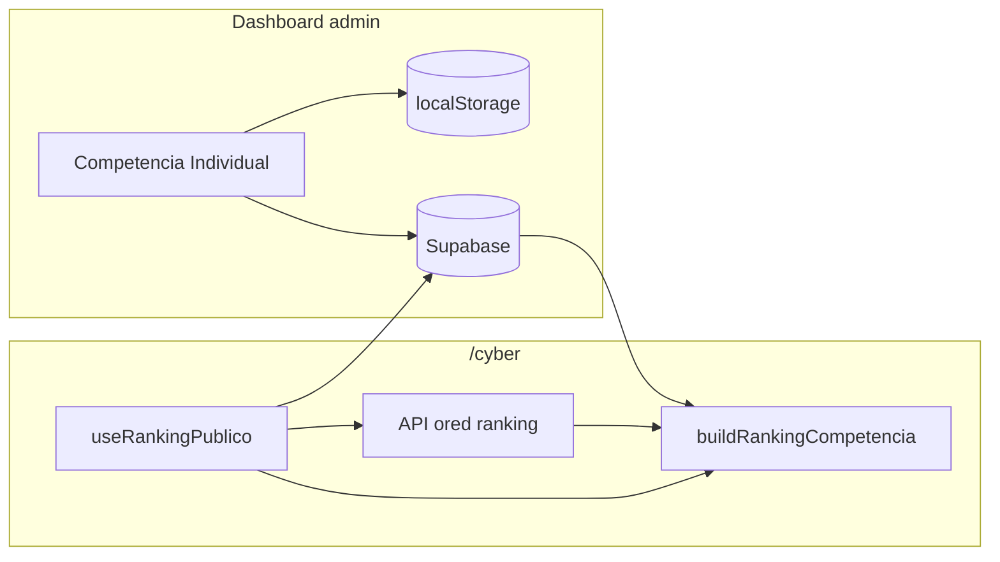
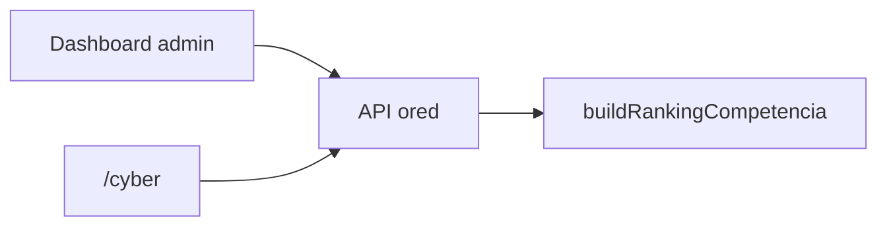

# PRD — Sincronización de puntos manuales de competencia (promesas / escrituras)

| Campo | Valor |
|-------|--------|
| **Versión** | 0.1 (borrador para revisión) |
| **Fecha** | 19 mayo 2026 |
| **Estado** | Opción B en implementación — deploy pendiente (SQL + env) |
| **Vida útil del sistema** | ~2 meses (Capital Open Cyber) |
| **Repositorio** | Dashboard Encuentro Smart (GitHub) |
| **Alcance** | Pestañas competencia admin + ranking público `/cyber` |
| **Implementación parcial** | Opción B (Supabase) en rama actual — ver §8 |

---

## 1. Resumen ejecutivo

El ranking público (`/cyber`) muestra puntos de competencia calculados con **reservas de la API ored** más **promesas y escrituras ingresadas manualmente** en el dashboard admin. Hoy las reservas se sincronizan bien vía ored; los puntos manuales **no**, porque solo viven en `localStorage` del navegador donde se editan.

**Síntoma:** `/cyber` solo refleja cambios manuales si admin y público están abiertos en el **mismo navegador** (eventos `storage` / `BroadcastChannel`).

**Objetivo:** Cualquier visitante de `/cyber` (otro navegador, TV, móvil) ve los mismos puntos manuales que guardó un admin, con latencia aceptable para un evento en vivo (~15–60 s).

**Recomendación para 2 meses:** **Opción B — Supabase** (rápida, sin depender de cambios en ored). **Opción A — extensión API ored** queda documentada como evolución si el equipo backend tiene capacidad en la primera semana del Cyber.

---

## 2. Contexto técnico actual

### 2.1 Fuentes de datos

| Dato | Origen | Consumidores | Refresh |
|------|--------|--------------|---------|
| Reservas Brekto (periodo Cyber) | `GET /api/public/encuentro-smart/ranking` (ored) | Dashboard, `/cyber` | Polling 30 min (configurable) |
| Promesas / escrituras por asesor | `localStorage` + caché remota opcional | Admin individual, `/cyber`, equipos | Manual + sync remoto 15 s |
| Actividades equipo (online/presencial) | `localStorage` + caché remota opcional | Competencia equipos | Igual |
| Auth admins competencia | Supabase OTP | Dashboard admin | Sesión |

### 2.2 Flujo de cálculo (sin cambios de reglas)

```
reservas (ored) ──┐
                  ├──► buildRankingCompetencia() ──► ranking asesores + equipos
manual (store) ───┘         ↑
                            SCORING en competenciaCapitalOpenScore.js
```

Archivos clave:

| Archivo | Rol |
|---------|-----|
| `src/api/rankingClient.js` | Cliente API ored |
| `src/utils/buildRankingCompetencia.js` | Merge reservas + manual |
| `src/utils/competenciaStorage.js` | localStorage + caché + eventos entre pestañas |
| `src/hooks/useCompetenciaIndividualManual.js` | Edición individual |
| `src/hooks/useCompetenciaManualPoints.js` | Edición equipos (actividades) |
| `src/hooks/useRankingPublico.js` | `/cyber` |
| `src/api/competenciaManualRemote.js` | Sync Supabase (implementación B) |

### 2.3 Rutas de la app

| Ruta | App | Auth |
|------|-----|------|
| `/` (default) | Dashboard admin (`App.jsx`) | Supabase opcional (admins competencia) |
| `/cyber` | `RankingPublicoPage` | Ninguna (público) |

---

## 3. Problema y usuarios

### 3.1 Problema (P0)

| ID | Descripción | Impacto |
|----|-------------|---------|
| **SYNC-01** | Puntos manuales solo en `localStorage` | Ranking público desactualizado fuera del mismo navegador |
| **SYNC-02** | Dos canales de verdad (ored vs manual) | Confusión operativa: “¿por qué la API no trae las promesas?” |
| **SYNC-03** | Guardado remoto requiere sesión admin | Sin login, cambios no llegan al público aunque Supabase esté activo |

### 3.2 Usuarios

| Persona | Acción | Necesidad |
|---------|--------|-----------|
| **Coordinador Cyber** | Edita promesas/escrituras por asesor | Guardar y que `/cyber` se actualice en minutos |
| **Público / pantallas** | Solo lectura en `/cyber` | Ver ranking fiel sin abrir admin |
| **Dev / deploy** | GitHub + env producción | Variables correctas en build de admin y `/cyber` |

### 3.3 Objetivos (medibles)

1. Tras guardar en admin, `/cyber` en **otro navegador** muestra los nuevos totales en **≤ 60 s** (target 15 s).
2. **Cero** dependencia de tener dos pestañas en el mismo equipo para operación normal.
3. Despliegue completable en **< 1 día** sin cambios en ored (opción recomendada).
4. Al cierre del Cyber, poder **apagar** almacenamiento manual sin deuda en API productiva.

### 3.4 No objetivos

- Historial / auditoría de cada edición (solo `updated_at` global por scope).
- Resolución de conflictos multi-admin sofisticada (último guardado gana).
- Edición de puntos manuales desde `/cyber`.
- Cambiar reglas de puntuación (`SCORING`).

---

## 4. Requisitos

### 4.1 Funcionales

| ID | Requisito | Prioridad |
|----|-----------|-----------|
| **RF-01** | Admin puede guardar `promesasCount` y `escriturasCount` por asesor | P0 |
| **RF-02** | Admin puede guardar actividades de equipo (flujo existente equipos) | P0 |
| **RF-03** | `/cyber` calcula el mismo ranking que el admin para mismos inputs | P0 |
| **RF-04** | Cambios manuales visibles en `/cyber` sin misma pestaña/navegador | P0 |
| **RF-05** | Si no hay store remoto configurado, degradar a comportamiento local (dev) | P1 |
| **RF-06** | Indicador opcional en admin: “última sync remota” / error de guardado | P2 |

### 4.2 No funcionales

| ID | Requisito | Valor objetivo |
|----|-----------|----------------|
| **RNF-01** | Latencia sync manual → público | ≤ 60 s (poll 15 s default) |
| **RNF-02** | Disponibilidad ranking público | Si ored falla, error claro; manual puede seguir en caché |
| **RNF-03** | Seguridad escritura | Solo usuarios autenticados (lista admin en app) |
| **RNF-04** | Seguridad lectura pública | Solo lectura de JSON de puntos; sin PII extra |
| **RNF-05** | Coste infra 2 meses | Mínimo (tabla pequeña, bajo QPS) |

---

## 5. Opciones de implementación

### 5.1 Matriz comparativa

| Criterio | A. API ored | B. Supabase | C. Solo localStorage | D. JSON estático en deploy |
|----------|-------------|-------------|----------------------|----------------------------|
| Resuelve SYNC-01 | ✅ | ✅ | ❌ | ⚠️ (manual) |
| Tiempo implementación | 1–3 semanas | 0.5–1 día | 0 | 0.5 día |
| Depende de equipo ored | Sí | No | No | No |
| Una fuente de verdad con reservas | ✅ | ❌ (2 APIs) | ❌ | ❌ |
| Adecuado para 2 meses | ⚠️ si hay banda backend | ✅ **recomendado** | ❌ | ⚠️ si pocos cambios/día |
| Complejidad en `/cyber` | Baja (1 poll) | Media (2 polls) | Ninguna | Baja |
| Desmontaje post-Cyber | Endpoint legacy | Borrar tabla | N/A | Borrar archivo |

### 5.2 Opción A — Extender API ored (ideal arquitectura)

**Idea:** Misma infra que reservas. El ranking público ya llama a ored; se añade lectura (y opcionalmente escritura) de puntos manuales.

#### Contrato propuesto (borrador para equipo ored)

**Lectura pública**

```http
GET /api/public/encuentro-smart/competencia-manual
```

```json
{
  "updated_at": "2026-05-19T18:30:00Z",
  "individual": {
    "version": 1,
    "asesores": {
      "asesor-key-1": { "promesasCount": 2, "escriturasCount": 1 }
    }
  },
  "team": {
    "version": 1,
    "teams": {
      "1": {
        "promesasCount": 0,
        "escriturasCount": 0,
        "actividadOnlineCount": 1,
        "actividadPresencialCount": 0
      }
    }
  }
}
```

**Escritura admin** (una de):

```http
PUT /api/admin/encuentro-smart/competencia-manual
Authorization: Bearer <token>
```

o reutilizar mecanismo de auth que ya use el dashboard para ored.

**Cambios en repo GitHub (frontend)**

| Tarea | Archivo / acción |
|-------|------------------|
| Cliente GET/PUT | `src/api/competenciaManualOred.js` (nuevo) |
| Eliminar o dejar fallback Supabase | `competenciaManualRemote.js` |
| Poll en `/cyber` | Un solo intervalo o incluir manual en respuesta de ranking |
| Admin save | `push` a ored tras guardar asesor/equipo |

**Ventajas:** Un poll, un proveedor, coherente con comentario actual “sin Supabase en `/cyber`”.  
**Riesgos:** Plazo backend; CORS y auth admin; coordinación deploy ored + GitHub.

**Cuándo elegir A:** El equipo ored puede entregar GET público (+ PUT admin) en la **primera semana** del Cyber.

---

### 5.3 Opción B — Supabase (recomendada para este PRD)

**Idea:** Tabla JSON con dos filas (`individual`, `team`). Lectura con `anon`, escritura con `authenticated` (admins ya usan Supabase OTP).

**Estado en repo:** Implementación inicial en:

- `docs/supabase-competencia-manual.sql`
- `src/api/competenciaManualRemote.js`
- `src/hooks/useCompetenciaManualRemoteSync.js`
- Hooks de edición + `useRankingPublico` / `App.jsx`

**Modelo de datos**

| Columna | Tipo | Notas |
|---------|------|-------|
| `scope` | `text` PK | `'individual'` \| `'team'` |
| `data` | `jsonb` | Mismo shape que `localStorage` hoy |
| `updated_at` | `timestamptz` | Para UI / debug |

**Flujo**

```
Admin guarda → localStorage (caché) + upsert Supabase (si sesión)
/cyber poll 15s → SELECT anon → applyRemoteManualCache → rebuild ranking
```

**Ventajas:** Despliegue desde GitHub sin ored; encaja con auth existente; apagado fácil.  
**Riesgos:** Segundo servicio; build `/cyber` necesita `SUPABASE_*`; admin sin login no sincroniza.

**Cuándo elegir B:** Ventana de 2 meses y necesidad de producción esta semana (**caso actual**).

---

### 5.4 Opción C — Solo localStorage (status quo)

Mantener sync entre pestañas del mismo navegador.

**Solo aceptable si:** Una sola laptop controla admin + TV siempre. No cumple RF-04 para uso público real.

---

### 5.5 Opción D — JSON en repo / CDN

Admin exporta JSON → PR/commit o upload a bucket → `/cyber` fetch del JSON.

**Solo si:** Actualizaciones ≤ 1/día y sin urgencia en vivo. No recomendado para competencia en directo.

---

## 6. Decisión recomendada

| Horizonte | Decisión |
|-----------|----------|
| **Cyber 2026 (2 meses)** | **Implementar y operar Opción B (Supabase)** |
| **Si ored entrega endpoint en semana 1** | Evaluar migración a A sin bloquear go-live (adapter en `competenciaManualRemote.js`) |
| **No hacer** | C para producción pública; D salvo emergencia |

### 6.1 Criterios de decisión registrados

1. Plazo del evento << tiempo típico de nuevo endpoint en ored.
2. Ya existe Supabase en el proyecto para admins.
3. El coste de un segundo poll de 15 s es irrelevante para 2 meses.
4. Unificar en ored es deseable pero no bloqueante.

---

## 7. Diseño de implementación — Opción B (plan de trabajo)

### 7.1 Fase 0 — Infra Supabase (responsable: quien tenga proyecto Supabase)

> Guía operativa: **`docs/DEPLOY-opcion-b-supabase.md`**

- [ ] Ejecutar `docs/supabase-competencia-manual.sql` en SQL Editor.
- [ ] Verificar políticas: `SELECT` para `anon`; `INSERT`/`UPDATE` para `authenticated`.
- [ ] Probar desde Table Editor: insert fila `individual` con JSON de prueba.

### 7.2 Fase 1 — GitHub / variables de entorno

| Variable | Dashboard | Build `/cyber` |
|----------|-----------|----------------|
| `SUPABASE_URL` | ✅ | ✅ |
| `SUPABASE_ANON_KEY` | ✅ | ✅ |
| `VITE_CYBER_MANUAL_POLL_MS` | opcional | ✅ (15000) |
| `VITE_ADMIN_EMAILS` | ✅ | no |

- [ ] Secrets en GitHub Actions / hosting (mismo proyecto Supabase).
- [ ] Actualizar `.env.example` en repo (ya documentado).
- [ ] Build de producción incluye `envPrefix: ['VITE_', 'SUPABASE_']` (vite.config.js).

### 7.3 Fase 2 — Operación admin

- [ ] Coordinadores con correo en `VITE_ADMIN_EMAILS`.
- [ ] Flujo: login OTP → editar → **Guardar** por asesor.
- [ ] Comunicar: sin sesión, cambios no salen al público.

### 7.4 Fase 3 — Validación (criterios de aceptación)

| # | Escenario | Resultado esperado |
|---|-----------|-------------------|
| AC-01 | Admin guarda +1 promesa en Chrome; `/cyber` en Safari | Total sube en ≤ 60 s |
| AC-02 | `/cyber` solo, sin admin abierto | Sigue mostrando último estado remoto |
| AC-03 | ored devuelve nuevas reservas | Ranking actualiza reservas (poll 30 min) y respeta manual remoto |
| AC-04 | Supabase caído | `/cyber` muestra última caché en memoria o local; warning en consola |
| AC-05 | Admin sin login guarda | local ok; remoto no; mensaje claro en UI (RF-06, pendiente) |

### 7.5 Fase 4 — Mejoras opcionales (P2, no bloquean go-live)

| Mejora | Esfuerzo | Beneficio |
|--------|----------|-----------|
| Toast si `push` falla (`not_authenticated`) | S | Menos errores operativos |
| Botón “Subir local → remoto” una vez | M | Migrar datos previos al Cyber |
| Supabase Realtime en lugar de poll | M | Latencia < 1 s |
| Adapter ored cuando exista endpoint | M | Unificar fuentes |

### 7.6 Cierre post-Cyber

- [ ] Export final JSON desde Supabase (backup).
- [ ] Desactivar políticas o eliminar tabla `encuentro_competencia_manual`.
- [ ] Remover hook sync y secrets si el repo se archiva.

---

## 8. Diseño de implementación — Opción A (si ored participa)

### 8.1 Cambios backend (ored)

1. Persistencia (DB ored): tabla o documento por evento `capital-open-2026`.
2. `GET` público sin auth (mismo CORS allowlist que ranking).
3. `PUT`/`PATCH` admin con validación de token o API key rotativa.
4. Validación de schema: mismos límites que frontend (`0–9999` promesas/escrituras).

### 8.2 Cambios frontend (GitHub)

```text
src/api/competenciaManualOred.js     # fetch + push
src/api/competenciaManualStore.js    # interfaz única: remote | ored | local
```

`competenciaManualStore.get()` usado por `buildRankingCompetencia` vía caché en memoria (igual que hoy).

**Orden de fallback sugerido:** ored → Supabase → localStorage.

### 8.3 Un solo poll en `/cyber` (opcional)

Extender respuesta de ranking:

```json
{
  "updated_at": "...",
  "periodo": { ... },
  "reservas": [ ... ],
  "competencia_manual": { "individual": { ... }, "team": { ... } }
}
```

Elimina `VITE_CYBER_MANUAL_POLL_MS` y simplifica cliente.

---

## 9. Arquitectura objetivo (diagrama)

### 9.1 Estado actual (híbrido)



### 9.2 Estado objetivo si ored absorbe manual (futuro)



---

## 10. Riesgos y mitigaciones

| Riesgo | Prob. | Impacto | Mitigación |
|--------|-------|---------|------------|
| Admin edita sin login | Alta | Alto | UI bloqueo + toast; checklist operativa |
| Dos admins pisan datos | Baja | Medio | Último guardado gana; coordinar roles |
| Supabase no en build `/cyber` | Media | Alto | Checklist deploy; smoke test Safari |
| Desfase ored vs manual | Media | Bajo | Etiquetar en UI fuentes y `updated_at` |
| Keys anon expuestas | — | Bajo | RLS solo SELECT; sin datos sensibles en JSON |

---

## 11. Plan de pruebas (checklist QA)

```text
[ ] SQL aplicado en Supabase prod
[ ] .env prod dashboard + cyber con SUPABASE_*
[ ] Login admin → guardar promesa → ver en /cyber otro browser
[ ] Reiniciar /cyber → datos persisten
[ ] Competencia equipos: actividad suma en ranking equipo público
[ ] Regresión: ranking solo reservas sin filas manual = 0 promesas/escrituras
[ ] Dev sin Supabase: app arranca; solo sync local entre pestañas
```

---

## 12. Sign-off

| Rol | Nombre | Fecha | Opción aprobada |
|-----|--------|-------|-----------------|
| Producto / Cyber | | | B / A / mixto |
| Frontend (GitHub) | | | |
| Backend ored | | | A sí / no |
| Infra Supabase | | | |

**Pregunta de cierre:** ¿El equipo ored puede comprometer `GET /competencia-manual` antes del go-live?  
- **No** → aprobar **B** y ejecutar §7.  
- **Sí** → planificar **A** en paralelo; **B** como red de seguridad hasta el corte.

---

## Anexo A — Shape JSON (contrato frontend actual)

**Individual** (`scope: individual`):

```json
{
  "version": 1,
  "asesores": {
    "<asesorStorageKey>": {
      "promesasCount": 0,
      "escriturasCount": 0
    }
  }
}
```

**Equipos** (`scope: team`):

```json
{
  "version": 1,
  "teams": {
    "<equipoId>": {
      "promesasCount": 0,
      "escriturasCount": 0,
      "actividadOnlineCount": 0,
      "actividadPresencialCount": 0
    }
  }
}
```

Clave de asesor: ver `asesorStorageKey()` en `src/utils/competenciaCapitalOpenIndividual.js`.

---

## Anexo B — Archivos a tocar por opción

| Opción | Crear | Modificar | Deprecar después |
|--------|-------|-----------|------------------|
| **B (activa)** | SQL doc, `competenciaManualRemote.js`, `useCompetenciaManualRemoteSync.js` | hooks manual, `useRankingPublico`, `App`, `.env.example` | — |
| **A** | `competenciaManualOred.js`, `competenciaManualStore.js` | `buildRankingCompetencia`, hooks save, `rankingClient` o nuevo poll | Supabase opcional |
| **C** | — | revert remote | remote layer |

---

*Documento vivo: actualizar versión y §6 cuando ored confirme o rechace endpoint.*
