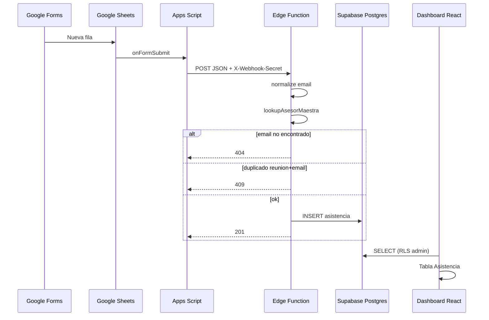

# PRD — Integración Google Forms → Asistencia a reuniones

| Campo | Valor |
|-------|--------|
| **Versión** | 0.1 (borrador para revisión) |
| **Fecha** | 19 mayo 2026 |
| **Estado** | Análisis arquitectura — implementación pendiente |
| **Repositorio** | Dashboard Encuentro Smart |
| **Alcance** | Webhook de asistencia + persistencia + lectura en dashboard admin |
| **Relacionado** | `PRD-competencia-manual-sync.md`, `DEPLOY-opcion-b-supabase.md` |

---

## 1. Resumen ejecutivo

Se requiere capturar automáticamente las respuestas de un **Google Form** de asistencia a reuniones y reflejarlas en el dashboard existente, identificando al asesor por **email** contra la **tabla maestra** ya usada en el proyecto.

**Flujo objetivo:**

```
Google Forms → Google Sheets → Apps Script (onFormSubmit) → Webhook HTTP POST → Persistencia → Dashboard
```

**Hallazgo crítico de arquitectura:** el repositorio actual es un **SPA React + Vite** sin servidor Node propio. No existe hoy `POST /api/forms/asistencia`. En desarrollo, el proxy de Vite reenvía **todo** `/api/*` a `ored.cl`, por lo que ese path no puede implementarse solo en el frontend.

**Recomendación:** añadir **capa serverless** alineada con lo ya desplegado (Supabase Edge Function + tabla Postgres), o extender la API de **ored** si el equipo backend puede exponer el endpoint en el mismo dominio de producción.

---

## 2. Análisis del stack actual

### 2.1 Stack detectado

| Capa | Tecnología | Notas |
|------|------------|--------|
| UI | React 18 + Vite 5 | `src/App.jsx`, rutas `/` y `/cyber` |
| Estilos | CSS Modules | Sin UI kit externo |
| Datos reservas | API ored `GET /api/public/encuentro-smart/ranking` | Proxy dev en `vite.config.js` |
| Datos alternativos | Supabase PostgREST (opcional) | `VITE_DATA_SOURCE=supabase` |
| Auth admin | Supabase OTP | `AuthContext`, `VITE_ADMIN_EMAILS` |
| Puntos manuales | Supabase `encuentro_competencia_manual` + localStorage | Patrón ya implementado |
| ORM | **No existe** | Acceso vía `@supabase/supabase-js` y JSON estático |
| Backend propio en repo | **No existe** | Sin Express/Fastify/Hono |

### 2.2 Tabla maestra de asesores (estado real)

Hoy la “maestra” **no** es una tabla SQL con `id / subgrupo / equipo`. Es un **JSON generado** desde Excel:

| Fuente | Archivo | Generación |
|--------|---------|------------|
| Planilla BPs | `Lista Asesores Activos *.xlsx` | `npm run sync:asesores` → `src/data/asesores-bp.json` |
| Equipo comercial interno | `src/data/equipoComercialInterno.js` | Mantenimiento manual en código |

**Shape actual por asesor en `asesores-bp.json`:**

```json
{
  "email": "ahernandez@capitalinteligente.cl",
  "nombre": "Adriana Paola Hernandez Castellon",
  "estado": "ACTIVO",
  "bp_slug": "vanema"
}
```

**Lookup en runtime:** `src/utils/asesorBpPlataforma.js` → `lookupAsesorBp(email)`  
Incluye **Equipo Comercial Interno** vía `lookupEquipoInternoBp()` (emails en `MIEMBROS_EQUIPO_COMERCIAL_INTERNO`).

### 2.3 Mapeo propuesto → campos del PRD

| Campo solicitado | Fuente en el proyecto | Ejemplo |
|------------------|----------------------|---------|
| `id` | **Nuevo:** `asesor_id` estable = hash/normalización de email (o UUID en sync) | `ahernandez@capitalinteligente.cl` → `e:ahernandez@...` |
| `nombre` | `asesores-bp.json.nombre` o `equipoComercialInterno` | "Adriana Paola Hernandez Castellon" |
| `email` | Clave primaria lógica (normalizada) | `ahernandez@capitalinteligente.cl` |
| `subgrupo` | BP / unidad comercial | `bp_slug` + `display` → ej. **Vanema** (`business_partners`) |
| `equipo` | Equipo Capital Open (competencia) | `equipoLabelForId(equipoIdForNivelPlataforma(...))` → ej. **Team Williams** |

> **Equipo comercial interno:** `subgrupo` = "Equipo Comercial Interno", `equipo` = null o bucket propio según regla de negocio (ver §6.3).

### 2.4 Componentes que no deben romperse

| Área | Archivos | Riesgo si se toca mal |
|------|----------|------------------------|
| Reservas / filtros | `useReservas.js`, `Filters.jsx`, `mapReserva.js` | Bajo si asistencia es módulo aparte |
| Competencia / ranking | `buildRankingCompetencia.js`, `/cyber` | **No mezclar** con puntos de competencia sin acuerdo explícito |
| Sync manual Supabase | `competenciaManualRemote.js`, RLS existente | Reutilizar patrones, no la misma tabla |
| Proxy Vite `/api` → ored | `vite.config.js` | Cualquier `/api/forms/*` local requiere **exclusión** en proxy o URL distinta |

### 2.5 Payload Google Forms (Apps Script actual)

```javascript
{
  timestamp: string,   // "Marca temporal"
  email: string,       // "Dirección de correo electrónico"
  nombre: string,      // "Nombre Completo" (informativo; no usar como clave)
  modalidad: string,   // "¿Cómo estás participando en la reunión?"
  reunion: string      // "¿En que reunión te encuentras?"
}
```

La **clave de negocio** para deduplicar: `(reunion, email_normalizado)`.

---

## 3. Problema y usuarios

### 3.1 Problema

| ID | Descripción |
|----|-------------|
| **ASIS-01** | Asistencia solo en Google Sheets; no visible en dashboard |
| **ASIS-02** | Sin vínculo automático asesor → BP / equipo Capital Open |
| **ASIS-03** | Riesgo de registros duplicados por reenvío del trigger |
| **ASIS-04** | Emails fuera de maestra generan datos huérfanos sin alerta clara |

### 3.2 Usuarios

| Persona | Necesidad |
|---------|-----------|
| **Asesor** | Enviar formulario en la reunión |
| **Coordinador** | Ver asistencia por reunión / equipo / BP en dashboard |
| **DevOps** | Webhook estable, logs, secret rotatable |

### 3.3 Objetivos

1. Cada envío válido del formulario persiste en **< 3 s** (p95) con respuesta HTTP clara.
2. **100%** de asesores reconocidos se enriquecen con `subgrupo` + `equipo` sin intervención manual.
3. Duplicados `(reunion, email)` → **409** o idempotencia (no segunda fila).
4. Email desconocido → **404** + log estructurado (Apps Script puede registrar error).
5. Dashboard admin puede **consultar** asistencias sin tocar flujos de reservas ni `/cyber`.

### 3.4 No objetivos (v0.1)

- Editar asistencia desde el dashboard.
- Sincronizar histórico masivo desde Sheets (solo trigger `onFormSubmit` + opcional backfill script aparte).
- Puntos de competencia Capital Open por asistencia.
- Auth de usuario final en el formulario (Google ya autentica el correo).

---

## 4. Requisitos funcionales

| ID | Requisito | Prioridad |
|----|-----------|-----------|
| **RF-01** | Endpoint `POST` que acepte JSON del Apps Script | P0 |
| **RF-02** | Normalizar email: `trim().toLowerCase()` | P0 |
| **RF-03** | Resolver asesor en maestra por email (+ fallback nombre solo para interno, opcional) | P0 |
| **RF-04** | Derivar `subgrupo` (BP) y `equipo` (Capital Open) automáticamente | P0 |
| **RF-05** | Persistir: `asesor_id`, `nombre`, `email`, `equipo`, `subgrupo`, `modalidad`, `reunion`, `timestamp` | P0 |
| **RF-06** | Unique `(reunion, email)` — rechazar o ignorar duplicado | P0 |
| **RF-07** | Email no en maestra → HTTP **404** + body JSON explicativo | P0 |
| **RF-08** | Logs estructurados (request id, email, reunión, resultado) | P0 |
| **RF-09** | Vista o pestaña en dashboard para listar / agregar por reunión | P1 |
| **RF-10** | Documentar URL final y secret para Apps Script | P0 |

### 4.1 Contrato del endpoint

**Ruta deseada por negocio:**

```http
POST /api/forms/asistencia
Content-Type: application/json
X-Webhook-Secret: <secret>
```

**Body (entrada):**

```json
{
  "timestamp": "19/05/2026 15:30:45",
  "email": "klettich@capitalinteligente.cl",
  "nombre": "Katherine Lettich",
  "modalidad": "Presencial",
  "reunion": "Norte Verde - Cotización"
}
```

**Respuestas:**

| HTTP | Caso | Body ejemplo |
|------|------|----------------|
| **201** | Creado | `{ "ok": true, "id": "uuid", "asesor_id": "...", "equipo": "...", "subgrupo": "..." }` |
| **200** | Duplicado idempotente (opcional) | `{ "ok": true, "duplicate": true }` |
| **400** | JSON inválido / campos faltantes | `{ "ok": false, "error": "validation", "fields": [...] }` |
| **401** | Secret incorrecto | `{ "ok": false, "error": "unauthorized" }` |
| **404** | Email no en maestra | `{ "ok": false, "error": "asesor_not_found", "email": "..." }` |
| **409** | Duplicado explícito (alternativa a 200) | `{ "ok": false, "error": "duplicate", "reunion": "...", "email": "..." }` |
| **500** | Error interno | `{ "ok": false, "error": "internal" }` |

**Validación mínima:**

- `email`, `reunion`, `timestamp` obligatorios (non-empty después de trim).
- `modalidad` opcional pero recomendada guardar string vacío como null.

---

## 5. Opciones de arquitectura (webhook + persistencia)

### 5.1 Matriz comparativa

| Criterio | A. API ored | B. Supabase Edge Function | C. Serverless en hosting estático (Netlify/Vercel) | D. Backend Node en repo |
|----------|-------------|---------------------------|-----------------------------------------------------|-------------------------|
| Encaja con repo actual | Requiere equipo ored | ✅ Ya usan Supabase | ✅ Si deploy es Vercel/Netlify | Cambio grande |
| Path `/api/forms/asistencia` en prod | ✅ Mismo dominio | URL `*.supabase.co/functions/v1/...` | ✅ Con functions | ✅ |
| Secret en servidor | ✅ | ✅ | ✅ | ✅ |
| ORM | N/A en ored (desconocido) | SQL / Supabase client | SQL vía SDK | Prisma opcional |
| Tiempo estimado | 1–2 semanas | **1–2 días** | 1–2 días | 3–5 días |
| Desmontaje post-evento | Coordinar ored | Borrar tabla + function | Borrar function | Borrar servicio |

### 5.2 Opción A — Extender API ored

**Idea:** `POST https://ored.cl/api/forms/asistencia` (o dominio de producción del dashboard si está detrás del mismo reverse proxy).

**Pros:** Una sola URL para Apps Script; coherente con proxy Vite actual.  
**Contras:** Dependencia de banda backend ored; fuera del control del repo frontend.

**Cuándo elegir:** Si ored puede entregar el endpoint en la primera semana y persistir en su DB.

### 5.3 Opción B — Supabase Edge Function (recomendada)

**Idea:** Misma infra que auth y competencia manual.

```
Apps Script
  → POST https://<project>.supabase.co/functions/v1/forms-asistencia
      Header: Authorization: Bearer <SERVICE_ROLE o ANON + custom secret>
      Header: X-Webhook-Secret: <FORMS_WEBHOOK_SECRET>
  → Edge Function (Deno)
      → lookup maestra (JSON embebido o tabla `asesores_maestra`)
      → INSERT encuentro_asistencia_reunion
  → Dashboard lee con anon/authenticated (RLS)
```

**Pros:**

- Implementable **solo en este repo** (SQL en `docs/`, function en `supabase/functions/`).
- No compite con proxy `/api` de Vite.
- Patrón probado (RLS, env secrets).

**Contras:**

- Apps Script debe apuntar a URL Supabase (no `TU-DOMINIO.com/api/...`) **salvo** que se configure un reverse proxy en producción.

**Maestra en la function:**

- **v0:** importar lógica equivalente a `lookupAsesorBp` + generar `asesor_id` / `subgrupo` / `equipo` en TypeScript compartido o duplicado mínimo.
- **v1:** tabla `asesores_maestra` en Postgres sincronizada por `sync:asesores` (CI).

### 5.4 Opción C — Function en Netlify/Vercel

Válida si el deploy de `dist/` ya es Vercel/Netlify. Implementar `api/forms/asistencia.ts` y conectar a Supabase o Postgres.

### 5.5 Opción D — Servidor Node en el monorepo

No recomendada para un evento de 2 meses: más superficie operativa (PM2, Docker, etc.).

---

## 6. Diseño recomendado (Opción B detallada)

### 6.1 Modelo de datos

**Tabla:** `public.encuentro_asistencia_reunion`

| Columna | Tipo | Notas |
|---------|------|-------|
| `id` | `uuid` PK | `gen_random_uuid()` |
| `asesor_id` | `text` NOT NULL | Id estable derivado del email |
| `nombre` | `text` | Desde maestra (no confiar solo en form) |
| `email` | `text` NOT NULL | Normalizado lower |
| `subgrupo` | `text` | BP display o "Equipo Comercial Interno" |
| `equipo` | `text` | Label Capital Open o null |
| `modalidad` | `text` | Presencial / Remoto / etc. |
| `reunion` | `text` NOT NULL | Texto libre del form |
| `registrado_en` | `timestamptz` | Parseado desde `timestamp` del form |
| `created_at` | `timestamptz` | default now() |
| `source` | `text` | default `'google_forms'` |
| `raw_payload` | `jsonb` | opcional, auditoría |

**Constraint:**

```sql
CREATE UNIQUE INDEX encuentro_asistencia_reunion_uniq
  ON public.encuentro_asistencia_reunion (reunion, email);
```

### 6.2 RLS y seguridad

| Rol | SELECT | INSERT |
|-----|--------|--------|
| `anon` | ✅ solo si se expone lectura pública (evaluar) | ❌ |
| `authenticated` (admin) | ✅ | ❌ desde cliente |
| **Service role / Edge Function** | ✅ | ✅ |

El **webhook no debe usar anon key en Apps Script**. Solo la Edge Function con secret + service role (server-side).

**Auth del webhook:**

```http
X-Webhook-Secret: <FORMS_WEBHOOK_SECRET>
```

Comparación timing-safe en la function. Rechazar sin secret → 401.

### 6.3 Algoritmo de resolución de asesor

```
1. emailNorm = email.trim().toLowerCase()
2. row = lookupAsesorBp(emailNorm)  // incluye equipo interno
3. si !row.bp_slug → 404
4. subgrupo = BP display desde business_partners[row.bp_slug]
5. equipo = capitalOpenTeamLabel(row.nivel_jerarquia_nombre)
6. asesor_id = `email:${emailNorm}`  // o hash corto
7. nombre = row.nombre ?? payload.nombre
```

**Equipo comercial interno:**

- `subgrupo` = `"Equipo Comercial Interno"`
- `equipo` = `null` o `"Equipo Comercial Interno"` (definir con negocio en AC-05)

### 6.4 Logging

En Edge Function (stdout → Supabase Logs):

```json
{
  "level": "info",
  "event": "forms.asistencia",
  "request_id": "uuid",
  "email": "klettich@...",
  "reunion": "Norte Verde",
  "result": "created|duplicate|not_found|error",
  "duration_ms": 42
}
```

No loguear `X-Webhook-Secret` ni payloads completos en producción (solo campos clave).

### 6.5 Cambios en el frontend (dashboard)

Nuevo módulo aislado — **no modificar** `buildRankingCompetencia` ni `/cyber`.

| Pieza | Ubicación propuesta |
|-------|-------------------|
| Cliente lectura | `src/api/asistenciaRemote.js` |
| Hook | `src/hooks/useAsistenciaReuniones.js` |
| UI | `src/features/asistencia/AsistenciaPage.jsx` o sub-tab en Resumen |
| Sidebar | Entrada "Asistencia" en `AppSidebar.jsx` |

Filtros sugeridos: reunión, subgrupo, equipo, rango de fechas.

### 6.6 Extensión de maestra (opcional v1)

Ampliar `sync-asesores-bp.mjs` para emitir en JSON (o tabla SQL):

```json
{
  "asesor_id": "email:klettich@capitalinteligente.cl",
  "email": "klettich@capitalinteligente.cl",
  "nombre": "Katherine Lettich",
  "subgrupo": "Equipo Comercial Interno",
  "equipo": null,
  "estado": "ACTIVO"
}
```

Módulo compartido: `src/utils/asesorMaestra.js` usado por webhook (function) y dashboard.

### 6.7 Apps Script (producción)

```javascript
function onFormSubmit(e) {
  const named = e.namedValues;
  const payload = {
    timestamp: named["Marca temporal"][0],
    email: named["Dirección de correo electrónico"][0],
    nombre: named["Nombre Completo"][0],
    modalidad: named["¿Cómo estás participando en la reunión?"][0],
    reunion: named["¿En que reunión te encuentras?"][0],
  };

  const url = PropertiesService.getScriptProperties().getProperty("WEBHOOK_URL");
  const secret = PropertiesService.getScriptProperties().getProperty("WEBHOOK_SECRET");

  const res = UrlFetchApp.fetch(url, {
    method: "post",
    contentType: "application/json",
    headers: { "X-Webhook-Secret": secret },
    payload: JSON.stringify(payload),
    muteHttpExceptions: true,
  });

  Logger.log(res.getResponseCode() + " " + res.getContentText());
}
```

**WEBHOOK_URL:** URL de Edge Function (Opción B) o `https://<dominio>/api/forms/asistencia` (Opción A/C).

### 6.8 Desarrollo local

| Tema | Comportamiento |
|------|----------------|
| Vite proxy `/api` → ored | **No** usar `/api/forms/asistencia` en dev sin excluir ruta |
| Prueba local | `supabase functions serve forms-asistencia` + curl |
| Dashboard | Lee tabla con Supabase anon + RLS de lectura para admins |

**Exclusión proxy (si se implementa handler en mismo dominio):**

```js
// vite.config.js — ejemplo
proxy: {
  '/api/forms': { target: 'http://localhost:54321', ... },
  '/api': { target: 'https://ored.cl', ... },
}
```

---

## 7. Plan de implementación por fases

### Fase 0 — Alineación (0.5 día)

- [ ] Confirmar Opción A vs B (ored vs Supabase).
- [ ] Definir `equipo` para asesores de Equipo Comercial Interno.
- [ ] Lista cerrada de valores `reunion` (¿texto libre o catálogo?).

### Fase 1 — Backend / persistencia (1 día)

- [ ] SQL `docs/supabase-asistencia-reunion.sql`
- [ ] Edge Function `forms-asistencia`
- [ ] Secret `FORMS_WEBHOOK_SECRET` en Supabase
- [ ] Tests curl: 201, 404, 409, 401

### Fase 2 — Maestra compartida (0.5 día)

- [ ] `src/utils/asesorMaestra.js` (lookup + enrich subgrupo/equipo)
- [ ] Incluir roster `equipoComercialInterno`
- [ ] (Opcional) extender `sync-asesores-bp.mjs` con `asesor_id`, `subgrupo`, `equipo`

### Fase 3 — Dashboard lectura (1 día)

- [ ] Hook + página Asistencia
- [ ] Tabla con filtros por reunión / BP / equipo
- [ ] Banner de resumen (total por reunión)

### Fase 4 — Google Apps Script + QA (0.5 día)

- [ ] Properties URL + secret
- [ ] Trigger `onFormSubmit` en entorno de prueba
- [ ] AC completados

**Total estimado:** 2–3 días hábiles (Opción B).

---

## 8. Criterios de aceptación

| # | Escenario | Resultado esperado |
|---|-----------|-------------------|
| AC-01 | Email activo en `asesores-bp.json` envía form | 201, fila con `subgrupo` y `equipo` correctos |
| AC-02 | Email de `equipoComercialInterno.js` | 201, no aparece en banner "sin BP" del ranking |
| AC-03 | Mismo email + misma reunión dos veces | 409 o 200 duplicate; una sola fila en DB |
| AC-04 | Email `noexiste@...` | 404, sin fila en DB |
| AC-05 | Secret incorrecto | 401 |
| AC-06 | Dashboard admin | Lista asistencias < 60 s después del POST |
| AC-07 | Competencia `/cyber` | Sin cambios de puntos ni orden |

---

## 9. Variables de entorno

| Variable | Dónde | Uso |
|----------|-------|-----|
| `FORMS_WEBHOOK_SECRET` | Supabase Function secrets | Validar Apps Script |
| `SUPABASE_SERVICE_ROLE_KEY` | Solo Edge Function | INSERT (nunca en Vite) |
| `SUPABASE_URL` | Function + dashboard | Cliente |
| `SUPABASE_ANON_KEY` | Dashboard lectura | SELECT con RLS |
| `WEBHOOK_URL` | Apps Script Properties | URL POST |
| `WEBHOOK_SECRET` | Apps Script Properties | Header |

**No agregar service role a `VITE_*`.**

---

## 10. Riesgos y mitigaciones

| Riesgo | Mitigación |
|--------|------------|
| Proxy Vite envía POST a ored | URL Supabase directa o excluir ruta en proxy |
| Form envía email personal no corporativo | 404 + capacitación; validar dominio `@capitalinteligente.cl` (opcional 422) |
| `timestamp` en formato ES | Parser explícito `dd/MM/yyyy HH:mm:ss` + fallback ISO |
| Maestra desactualizada | Re-run `sync:asesores` antes del evento; alerta si 404 > umbral |
| Trigger Apps Script falla silencioso | `muteHttpExceptions` + log + alerta email admin (opcional) |

---

## 11. Diagrama de flujo



---

## 12. Decisión pendiente (para el stakeholder)

1. **¿Webhook en ored o Supabase?** → Recomendación: **Supabase Edge Function**.
2. **¿`equipo` para comercial interno?** → null vs bucket propio.
3. **¿Duplicado 409 vs 200 idempotente?** → Recomendación: **200** con `duplicate: true` (Apps Script no reintenta en error).
4. **¿Exponer asistencia en `/cyber`?** → Fuera de alcance v0.1.

---

## 13. Referencias en el repo

| Tema | Archivo |
|------|---------|
| Maestra asesores | `src/data/asesores-bp.json`, `scripts/sync-asesores-bp.mjs` |
| Lookup email | `src/utils/asesorBpPlataforma.js`, `src/utils/equipoComercialInterno.js` |
| Equipos Capital Open | `src/data/competenciaCapitalOneTeams.js`, `src/utils/competenciaIndividualToEquipo.js` |
| Patrón Supabase | `docs/supabase-competencia-manual.sql`, `src/api/competenciaManualRemote.js` |
| Proxy API | `vite.config.js` |
| PRD similar | `docs/PRD-competencia-manual-sync.md` |

---

*Documento listo para revisión. Tras aprobación de la opción (§5 / §12), se procede a implementación en fases (§7) sin romper competencia ni ranking público.*
